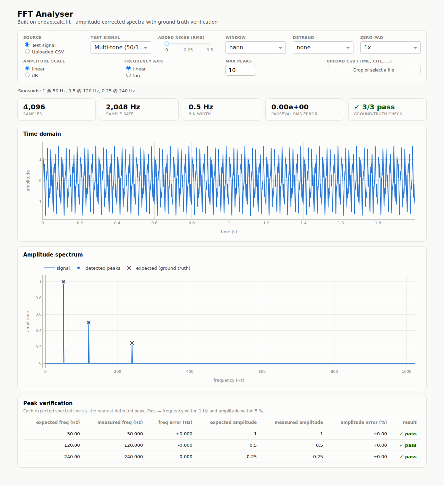

# FFT Analyser

A measurement-grade FFT analyser on the [endaq-python](../README.md)
foundation, following the conventions of professional dynamic-signal
analysers — scaling per Heinzel 2002 / SciPy, windows per Harris 1978, tone
metrics per IEEE 1241 / audio-analyzer practice. The conventions, formulas
and references are documented in [CONVENTIONS.md](CONVENTIONS.md); every one
of them is pinned by an automated test.

Built-in test signals carry their ground truth (spectral lines, PSD noise
floors, THD/ENOB values), which the UI overlays on the measured results and
scores live — so you can *see*, and pytest can *prove*, that the analyser is
correct.



## Running the UI

```bash
pip install endaq dash        # dash is the only extra dependency
python -m fft_analyser        # then open http://127.0.0.1:8050
```

Options: `--host`, `--port`, `--debug`.

### No-install version

[`public/index.html`](../public/index.html) is the analyser ported to the
browser, and it works **only on real data**: pureMEMS `.bin` waveforms
opened locally (decoded in the browser — the file never leaves the machine)
or live monitors via the read-only Worker. It contains no sample or
synthetic signals; the correctness of the shared engine is proven by the
Python test suite instead.

Its engine is a faithful port, checked against the Python one: all seven
windows' `S1`/`S2`/NENBW/scalloping agree to six decimals, the tone metrics
agree exactly (THD 2.2361 %, SINAD 33.010 dB, SFDR 33.979 dBc, 8-bit ENOB
8.017), and the `.bin` decoder is **bit-exact** across every sample of both
vendor sample files.

One difference from the Python module: the browser FFT is radix-2, so a
segment is the largest power of two that fits. The readout says how many
samples were actually covered when that is fewer than the record holds.

### Deploying the browser build

`public/` is a static site — [`wrangler.jsonc`](../wrangler.jsonc) deploys
it to Cloudflare Workers with `npx wrangler deploy`. There is **no build
step**: leave the build command empty and set the output directory to
`public`.

The Dash app cannot be deployed this way — it is a Python server, and
Workers/Pages run static assets and JavaScript. Host that on a machine with
a Python runtime (see *Going live* below).

### Live monitors from the deployed page

A browser page cannot hold an API password, and browsers forbid calling
another origin's API, so the deployed page needs a server-side middleman to
read live data. [`worker/index.js`](../worker/index.js) is that middleman:
a Cloudflare Worker that holds the credentials as encrypted secrets,
performs the same read-only calls as `x2_client.py`, and hands the browser
raw waveform bytes to decode locally.

It is **not** a path proxy — it exposes a fixed set of operations
(`/api/monitors`, `/api/files`, `/api/waveform`), so no browser request can
reach the endpoints that change device settings. Access is gated on a token
you set; without it, live data refuses to work and the page stays a
file-analysis tool.

Step-by-step setup: [`worker/SETUP.md`](../worker/SETUP.md). The whole
chain can be exercised locally against [`tests/worker/fake_x2.py`](../tests/worker/fake_x2.py)
without touching a real site.

## The front panel

- **Quantity** — velocity (mm/s RMS) and displacement (µm RMS), both
  integrated from acceleration in the frequency domain with a 2 Hz
  high-pass (the ISO 20816 machine-vibration conventions), plus peak
  amplitude, RMS amplitude, power spectrum (u² RMS), PSD (u²/Hz) and ASD
  (u/√Hz), each with correct S1/S2 window normalization and DC/Nyquist
  single-sided handling.
- **Analyst cursors** (browser page) — running-speed harmonics with
  per-order amplitude readout (speed entered in Hz or RPM), sideband
  cursors (centre ± spacing), and bearing defect frequency overlays
  (BPFO/BPFI/BSF/FTF ×1–3 from [`bearings.py`](bearings.py) geometry —
  nominal presets or custom entry). A selection dragged on the time
  waveform re-runs the whole analysis on just that span (linked zoom).
- **Window** — rectangular, hann, hamming, blackman, blackman-harris,
  flattop, kaiser(β=14), with live figures of merit displayed (NENBW/ENBW,
  sidelobe level, scalloping loss, recommended overlap).
- **Averaging** — Welch segmentation with selectable segment length and
  overlap; linear (RMS) averaging or peak hold; averages count shown.
- **Display** — linear/dB amplitude, linear/log frequency, zero-padding
  (1–8×), detrend (none/mean/linear), harmonic markers.
- **Tone metrics** — fundamental, THD, THD+N, SNR, SINAD, ENOB, SFDR,
  RMS (time-domain and from the PSD integral), crest factor.
- **Spectrogram** — short-time PSD in dB with the same scaling.
- **Verification** — ground-truth overlay (✕), detected peaks (●), a
  pass/fail table per expected line, and a Parseval energy self-check tile.
- **Sources** — built-in test signals (with adjustable added noise), or
  upload a CSV (first column: time in seconds; other columns: channels).
  Example: [`sample_data/three_tone_noisy.csv`](sample_data/three_tone_noisy.csv).

## Test signals and what they prove

| Signal | Ground truth | What it verifies |
|---|---|---|
| Multi-tone | lines at 50/120/240 Hz, amps 1.0/0.5/0.25 | frequency & amplitude accuracy |
| Single / two-tone | known lines | scaling; frequency resolution |
| Distorted tone | THD = √(Σr²) = 2.236 % | THD/THD+N/SINAD/SFDR |
| Quantized tone | ENOB ≈ bits (6.02b+1.76 dB SINAD) | SINAD/ENOB |
| DC + tone | 0 Hz bin = offset | DC-bin scaling, detrend |
| Square wave | odd harmonics at 4A/πk | multi-line accuracy, THD ≈ 48.3 % |
| Impulse | flat spectrum at 2A/N | broadband flatness |
| Linear chirp | energy confined to 20–400 Hz | leakage; spectrogram ridge |
| White noise | PSD floor = 2σ²/fs | density scaling, window/length invariance |

## Real data: pureMEMS waveforms and the X2 Cloud

### Sources

- **pureMEMS `.bin`** — drop up to five vendor waveform files onto the
  UI. [`pure_mems.py`](pure_mems.py) decodes the prefix-coded,
  delta-compressed format to m/s². It reproduces the vendor's reference
  decoder **exactly** on their own sample files (verified sample-for-sample
  in `tests/fft_analyser/test_pure_mems.py`) and runs ~20× faster, because
  it walks the bit stream by index instead of re-slicing it.
- **X2 Cloud** — connect to a site and pull the latest uploaded waveform
  for up to five monitors.

### The cloud client is read-only by construction

[`x2_client.py`](x2_client.py) can only read:

- every data request goes through one `_get()` that issues `GET` and
  refuses any path outside the allowlist;
- the two mutating endpoints in the API — `POST .../control/{cmd}`
  (relays, acknowledge, enable/disable inputs) and `POST .../config`
  (device settings, including measurement interval and duration) — have
  **no method in this module at all**;
- the only `POST` is `login`, which the API requires for a session cookie
  and which does not reach any device. `logout` is deliberately absent so
  no request can invalidate a session another tool is using.

`tests/fft_analyser/test_x2_client.py` asserts these properties, including
that requesting a control or config path raises rather than opening a
socket.

Nothing asks a sensor to measure or upload — the client reads files the
devices have **already** uploaded to the cloud.

### Going live

Live data needs the app to run somewhere with a network route to the API
host — a sandbox or a locked-down CI runner will not do, and the failure
looks like an auth error when it is really a blocked TLS tunnel. Check
before you debug credentials:

```bash
cp fft_analyser/deploy/.env.example .env && chmod 600 .env   # fill it in
set -a && . ./.env && set +a
python -m fft_analyser.preflight
```

Preflight walks the four things that actually stop a connection — imports,
DNS, the TLS tunnel, then login and site access — and prints the sensor
addresses you need for `X2_MONITORS`. It is read-only and stops before
sending credentials if the host is unreachable.

Then run it:

```bash
python -m fft_analyser --serve --connect --host 0.0.0.0 --port 8050
```

`--serve` runs Waitress (a production WSGI server) instead of Flask's
development server; `--connect` logs in at startup from the `X2_*`
environment variables and preloads `X2_MONITORS`, so the page opens
already pointed at the site. Credentials come from the environment rather
than the browser — out of the URL, out of shell history, and off the
screen. A container build is in [`deploy/Dockerfile`](deploy/Dockerfile).

**What "live" means here.** These sensors upload a waveform on their own
schedule (`config_mlt_auto_interval`) — it is not a continuous stream. The
live feed polls the file listing and refreshes when a *newer* upload
appears, so set `X2_POLL_SECONDS` to match the upload interval; polling
faster only burns API calls. Two other operational facts: download links
are pre-signed and expire **one hour** after listing (the client always
re-lists before downloading, so this only matters if you cache them
yourself), and the session cookie will eventually expire — reconnect from
the Live monitors panel if reads start failing with 403.

Making a sensor measure *sooner* would require `POST .../config` to change
its interval, which this client deliberately cannot do.

### Analysis defaults for measured data

Real accelerometers carry a static gravity component: in the vendor's own
three-axis sample the DC vector is **1.043 g**, four times larger than the
entire 10–1000 Hz vibration content. Left in, it lands in the 0 Hz bin and
dominates every amplitude and overall-RMS reading. Selecting a real-data
source therefore switches the analyser to `detrend="mean"`, 8192-sample
segments, linear averaging — and the **velocity (mm/s RMS)** spectrum
quantity, the units a vibration technician reads (ISO 20816; see
[CONVENTIONS.md](CONVENTIONS.md) §1). The time-domain waveform of an
acceleration signal is displayed in **g**. Use `detrend="none"` only when
the DC level is itself the measurement (checking sensor orientation, say).

The monitor bank reports **Vel RMS 10–1000 Hz in mm/s** (the ISO 20816
severity number that commercial platforms trend) and the 10–1000 Hz
acceleration band RMS as overall levels, plus crest factor, DC offset in
g, and temperature. Each summary also carries a `signal_quality()` report:
timestamp uniformity (jitter, gaps, duplicated stamps) and samples at the
±16 g sensor rail — a clipped sensor manufactures spurious harmonics, so
the gate flags it before anyone reads the spectrum. The browser page shows
the same Vel RMS readout and clipping warning.

```python
from fft_analyser.monitors import MonitorBank, overall_levels

bank = MonitorBank()                       # holds up to 5 monitors
bank.add_file("waveform.bin")              # offline
bank.connect(user, password, base_url, site_id)   # or read-only cloud
bank.load_from_cloud([addr1, addr2])
print(overall_levels(bank, axis="Z"))
```

## Library API

```python
from fft_analyser import analyze, tone_metrics, band_rms, spectrogram

result = analyze(df, quantity="psd", window="hann",
                 nperseg=4096, overlap=0.5, averaging="linear")
result.spectrum        # DataFrame indexed by frequency
result.enbw_hz         # equivalent noise bandwidth per bin
result.n_segments      # averages taken
band_rms(result, 10, 1000)   # band-limited RMS from the PSD integral
m = tone_metrics(df)         # THD, THD+N, SNR, SINAD, ENOB, SFDR, crest...
```

`compute_spectrum()`, `find_spectral_peaks()`, `compare_to_expected()` and
`parseval_rms_error()` from v0.1 are unchanged.

## Tests

```bash
python -m pytest tests/fft_analyser
```

[`VALIDATION.md`](VALIDATION.md) holds the three-way validation table —
closed-form theory vs this module vs an independent SciPy computation of
the same samples — regenerated by `python -m fft_analyser.validation` and
enforced row-by-row in the suite. Adversarial coverage
(`test_adversarial.py`) includes unresolvable tone pairs, a −80 dBc tone
under leakage, drifting DC, near-Nyquist content, clipped sensors,
corrupted time bases and records shorter than the requested segment.

The suite pins every documented convention: window figures of merit against
the Harris/Heinzel tables, all scaling identities (PS/PSD = ENBW,
peak = √2·RMS, ASD² = PSD), tone-amplitude invariance across windows,
noise-floor invariance across windows and FFT lengths, PSD integral =
signal power, Welch segment counts and 1/√M variance reduction, band RMS,
spectrogram ridge tracking, THD/SNR/SINAD/ENOB/SFDR against analytical
ground truth, DC/Nyquist scaling, Parseval, and error handling.

## Library fixes made alongside this module

- `endaq.calc.fft.dct()` and `dst()` were swapped — each called the other's
  SciPy transform. Fixed, with regression tests in
  `tests/calc/test_fft.py::TestDCTDST`.
- `endaq.calc.fft.fft()` docstring recommended itself for real input where
  it meant `rfft()`.
